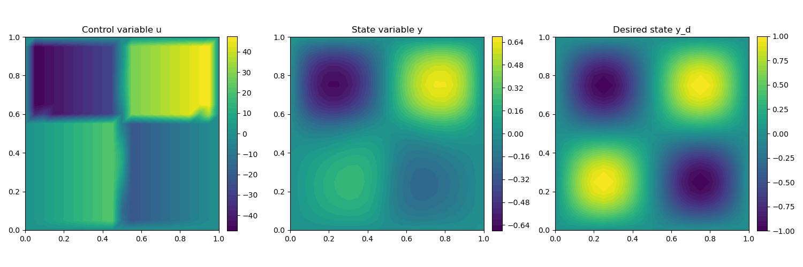

.. _demo_box_constraints:

Control Constraints
===================

Problem Formulation
-------------------

In this demo we investigate the basics of cashocs for
optimal control problems. To do so, we investigate the "mother
problem" of PDE constrained optimization, i.e.,

.. math::

    &\min\; J(y,u) = \frac{1}{2} \int_{\Omega} \left( y - y_d \right)^2 \text{d}x + \frac{\alpha}{2} \int_{\Omega} u^2 \text{d}x \\
    &\text{ subject to } \quad \left\lbrace \quad
    \begin{alignedat}{2}
    -\Delta y &= u \quad &&\text{ in } \Omega,\\
    y &= 0 \quad &&\text{ on } \Gamma, \\
    u_a \leq u &\leq u_b \quad &&\text{ in } \Omega
    \end{alignedat} \right.

(see, e.g., `Tröltzsch, Optimal Control of Partial Differential Equations <https://doi.org/10.1090/gsm/112>`_
or `Hinze, Pinnau, Ulbrich, and Ulbrich, Optimization with PDE constraints <https://doi.org/10.1007/978-1-4020-8839-1>`_.

This example differs from the first one only in the fact that
we now also consider box constraints on the control variables
Here, the functions :math:`u_a` and :math:`u_b` are :math:`L^\infty(\Omega)`
functions. As before, we consider
as domain the unit square, i.e., :math:`\Omega = (0, 1)^2`.

Implementation
--------------

The complete python code can be found in the file :download:`demo_box_constraints.py </../../demos/documented/optimal_control/box_constraints/demo_box_constraints.py>`,
and the corresponding config can be found in :download:`config.ini </../../demos/documented/optimal_control/box_constraints/config.ini>`.

Initialization
**************

The beginning of the script is completely identical to the
one of :ref:`previous example <demo_poisson>`, so we only restate the corresponding
code in the following ::

    from fenics import *
    import cashocs

    config = cashocs.create_config('./config.ini')

    mesh, subdomains, boundaries, dx, ds, dS = cashocs.regular_mesh(50)
    V = FunctionSpace(mesh, 'CG', 1)

    y = Function(V)
    p = Function(V)
    u = Function(V)

    e = inner(grad(y), grad(p))*dx - u*p*dx

    bcs = cashocs.create_bcs_list(V, Constant(0), boundaries, [1,2,3,4])

    y_d = Expression('sin(2*pi*x[0])*sin(2*pi*x[1])', degree=1)
    alpha = 1e-6
    J = Constant(0.5)*(y - y_d)*(y - y_d)*dx + Constant(0.5*alpha)*u*u*dx

Definition of the control constraints
*************************************

Here, we have nearly everything at hand to define the optimal
control problem, the only missing ingredient are the box constraints,
which we define now. For the purposes of this example, we
consider a linear (in the x-direction) corridor for these
constraints, as it highlights the capabilities of the code.
Hence, we define the lower and upper bounds via ::

    u_a = interpolate(Expression('50*(x[0]-1)', degree=1), V)
    u_b = interpolate(Expression('50*x[0]', degree=1), V)

which just corresponds to two functions, generated from
Expression objects via interpolation. These are then put
into the list `cc`, which models the control constraints, i.e., ::

    cc = [u_a, u_b]

.. note::

    As an alternative way of specifying the box constraints, one
    can also use regular float or int objects, in case that they
    are constant. For example, the constraint that we only want to
    consider positive value for u, i.e., :math:`0 \leq u \leq +\infty` can
    be realized via ::

        u_a = 0
        u_b = float(inf)
        cc = [u_a, u_b]

    and completely analogous with float(-inf) for no constraint
    on the lower bound.

Setup of the optimization problem and its solution
**************************************************

Now, we can set up the optimal control problem as we did before,
using the additional keyword argument control_constraints into which
we put the list ``cc``, and then solve it via the :py:meth:`ocp.solve() <cashocs.OptimalControlProblem.solve>`
method ::

    ocp = cashocs.OptimalControlProblem(e, bcs, J, y, u, p, config, control_constraints=cc)
    ocp.solve()

To check that the box constraints are actually satisfied by our
solution, we perform an assertion ::

    import numpy as np
    assert np.alltrue(u_a.vector()[:] <= u.vector()[:]) and np.alltrue(u.vector()[:] <= u_b.vector()[:])

which shows that they are indeed satisfied. The visualization is carried out analogously
to before, and should yield the following result

