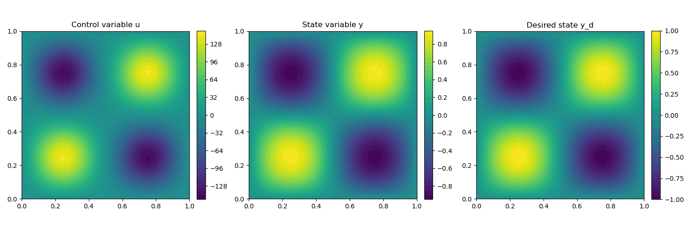

.. _demo_nonlinear_pdes:

Optimal Control with Nonlinear PDE Constraints
==============================================

Problem Formulation
-------------------

In this demo, we take a look at the case of nonlinear PDE constraints for optimization
problems. As a model problem, we consider

.. math::

    &\min\; J(y,u) = \frac{1}{2} \int_{\Omega} \left( y - y_d \right)^2 \text{d}x + \frac{\alpha}{2} \int_{\Omega} u^2 \text{d}x \\
    &\text{ subject to } \quad \left\lbrace \quad
    \begin{alignedat}{2}
    -\Delta y + c y^3 &= u \quad &&\text{ in } \Omega,\\
    y &= 0 \quad &&\text{ on } \Gamma.
    \end{alignedat} \right.

As this problem has a nonlinear PDE as state constraint, we have to modify the config
file slightly. In particular, in the Section :ref:`[State Equation] <config_ocp_state_equation>`
we have to write ::

    is_linear = False

Note, that ``is_linear = False`` works for any problem, as linear equations are just a special case
of nonlinear ones, and the Newton method converges in a single iteration for these.
However, in the opposite case, FEniCS will raise an error, and a real nonlinear
equation cannot be solved using ``is_linear = False``.

Implementation
--------------

The complete python code can be found in the file :download:`demo_nonlinear_pdes.py </../../demos/documented/optimal_control/nonlinear_pdes/demo_nonlinear_pdes.py>`,
and the corresponding config can be found in :download:`config.ini </../../demos/documented/optimal_control/nonlinear_pdes/config.ini>`.

Initialization
**************

Thanks to the high level interface for implementing weak formulations, this problem
is tackled almost as easily as the one in :ref:`demo_poisson`. In particular, the entire initialization,
up to the definition of the weak form of the PDE constraint, is identical, and we have ::

    from fenics import *
    import cashocs

    config = cashocs.create_config('config.ini')
    mesh, subdomains, boundaries, dx, ds, dS = cashocs.regular_mesh(25)
    V = FunctionSpace(mesh, 'CG', 1)

    y = Function(V)
    p = Function(V)
    u = Function(V)

For the definition of the state constraints, we use essentially the same syntax as
we would use for the problem in FEniCS, i.e., we write ::

    c = Constant(1e2)
    e = inner(grad(y), grad(p))*dx + c*pow(y, 3)*p*dx - u*p*dx

.. note::

    In particular, the only difference between the cashocs implementation of this weak form
    and the FEniCS one is that, as before, we use :py:class:`fenics.Function` objects for both the state and
    adjoint variables, whereas we would use `Function` objects for the state, and
    :py:class:`fenics.TestFunction` for the adjoint variable, which would actually play the role of the
    test function. Other than that, the syntax is, again, identical to the one of
    FEniCS.

Finally, the boundary conditions are defined as before ::

    bcs = cashocs.create_bcs_list(V, Constant(0), boundaries, [1, 2, 3, 4])

Solution of the optimization problem
************************************

To define and solve the optimization problem, we now proceed exactly as in
:ref:`demo_poisson`, and use ::

    y_d = Expression('sin(2*pi*x[0])*sin(2*pi*x[1])', degree=1)
    alpha = 1e-6
    J = Constant(0.5)*(y - y_d)*(y - y_d)*dx + Constant(0.5*alpha)*u*u*dx

    ocp = cashocs.OptimalControlProblem(e, bcs, J, y, u, p, config)
    ocp.solve()

The results looks like this

